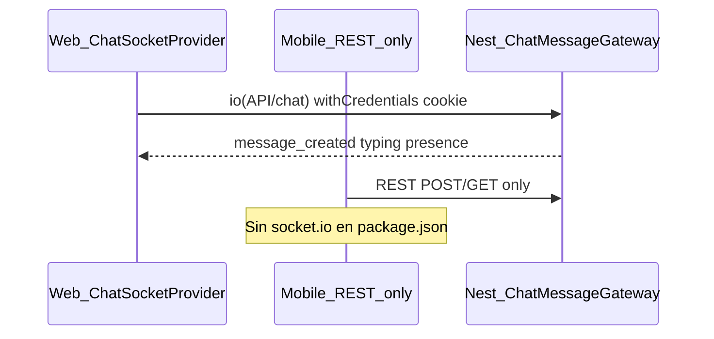

# Verificar y alinear sockets de chat (web + mobile)

## Diagnóstico

| Superficie | Estado |
| --- | --- |
| Backend [`chat-message.gateway.ts`](wiauto-backend/src/contexts/chat/gateways/chat-message.gateway.ts) | Namespace `/chat`, eventos en [`chat-socket.events.ts`](wiauto-backend/src/contexts/chat/gateways/chat-socket.events.ts), auth vía [`WsJwtGuard`](wiauto-backend/src/contexts/auth/guards/ws-jwt.guard.ts) (cookie **o** `handshake.auth.token`) |
| Web [`chatSocketContext.tsx`](wiauto-frontend/components/chat/context/chatSocketContext.tsx) + [`ChatPanel.tsx`](wiauto-frontend/components/chat/ChatPanel.tsx) | Conecta con cookies (`withCredentials`), join/leave/typing/presence, actualiza React Query | 
| Mobile [`user-messages.tsx`](wiauto-mobile-app/src/app/(app)/user-messages.tsx) + [`use-user-messages.ts`](wiauto-mobile-app/src/hooks/use-user-messages.ts) | **Sin sockets**: lista/conversación solo REST; no hay `socket.io-client` |

### Bug web confirmado (reconnect)

En [`chatSocketContext.tsx`](wiauto-frontend/components/chat/context/chatSocketContext.tsx):

- `joinChat` hace early-return si `joinedChatsRef` ya tiene el `chatId`.
- Al desconectar, el cleanup de [`chatContent.tsx`](wiauto-frontend/components/chat/chatContent.tsx) llama `leaveChat`, pero `leaveChat` no-op si `!socket.connected` **y no borra** el id del ref.
- Tras reconnect: `joinChat` cree que ya está unido → **no re-emite `join_chat`** → deja de recibir `message_created` / typing en esa sala.

### Auth web vs mobile

- Web: cookie `access_token` dominio `.wiauto.es` + `withCredentials` (OK si `FRONTEND_ORIGINS` incluye el origen web).
- Mobile: token en SecureStore → debe conectar con `auth: { token: accessToken }` (el guard ya lo soporta). **No** usar cookies.

## Enfoque elegido

1. **Arreglar reconnect en web** (mínimo cambio).
2. **Implementar ChatSocket en mobile** espejando el contrato web/backend (misma lista de eventos).
3. Montar el provider en las pantallas de mensajes (lista + conversación), no en todo el árbol de la app.

No tocar backend salvo comprobar/documentar `FRONTEND_ORIGINS` en el checklist (CORS del gateway).

---

## 1. Web — fix reconnect + re-join

Archivo: [`wiauto-frontend/components/chat/context/chatSocketContext.tsx`](wiauto-frontend/components/chat/context/chatSocketContext.tsx)

- En `handleDisconnect`: vaciar `joinedChatsRef` (las rooms del servidor ya no existen).
- En `handleConnect` / tras reconnect: opcionalmente re-join de chats activos; como mínimo, con el ref limpio el `useEffect` de `ChatContent` (`isConnected` → `joinChat`) volverá a unirse.
- En `leaveChat`: si el socket no está conectado, **igual** hacer `joinedChatsRef.delete(chatId)`.
- Verificar que los nombres de eventos coinciden 1:1 con backend (ya coinciden: `join_chat`, `message_created`, etc.).

Sin cambios estructurales en `ChatPanel` / `ChatContent` salvo lo necesario por el fix.

---

## 2. Mobile — ChatSocketProvider + cableado

### Dependencia

- Añadir `socket.io-client` en [`wiauto-mobile-app/package.json`](wiauto-mobile-app/package.json).

### Constantes / URL

- Nuevo [`src/constants/chat-socket-events.ts`](wiauto-mobile-app/src/constants/chat-socket-events.ts) (misma forma que web/backend).
- Helper `getChatSocketUrl()` = `env.apiUrl` sin slash final + namespace `/chat`.

### Provider

Nuevo [`src/providers/chat-socket-provider.tsx`](wiauto-mobile-app/src/providers/chat-socket-provider.tsx):

- Conectar solo si hay sesión: `auth: { token }` desde `getRequiredAccessToken` / `authStorage`.
- `transports: ['websocket']` (preferible en RN; polling como fallback si hace falta).
- Listeners → actualizar React Query con las keys de [`queryKeys.messages`](wiauto-mobile-app/src/lib/query-keys.ts):
  - `message_created` / `updated` / `deleted` → cache de conversación
  - `unread_updated` / mensajes → invalidar lista de threads
  - typing + presence en estado local del context (como web)
- API pública: `isConnected`, `joinChat`, `leaveChat`, `emitTypingStart/Stop`, `subscribePresence`, `typingByChatId`, `presenceByUserId`.
- Limpiar `joinedChatsRef` en disconnect (mismo fix que web).
- Reconectar al volver a foreground (`AppState`) si hace falta.

### Montaje

- Envolver lista + conversación:
  - [`user-messages.tsx`](wiauto-mobile-app/src/app/(app)/user-messages.tsx) (y tab chat si aplica)
  - [`user-message-conversation-route-content.tsx`](wiauto-mobile-app/src/components/user-messages/user-message-conversation-route-content.tsx) (o un layout compartido si existe)
- En conversación: `joinChat(chatId)` cuando `isConnected`, cleanup `leaveChat`; emitir typing desde el composer.
- Header: presence “En línea / Desconectado” si ya hay UI de badge (hoy usa assets online/offline mock) — cablear `presenceByUserId` al menos en conversación.

### Envío de mensajes

- Seguir enviando por REST (`useSendChatMessage`); el socket del emisor y del receptor actualizan la cache vía `message_created` (como en web). Invalidación actual del mutation puede quedarse como safety net.

---

## 3. Verificación manual (checklist del plan)

**Web**

1. Dos usuarios en el mismo chat → mensaje aparece sin refresh.
2. Typing indicator aparece/desaparece.
3. Presence “En línea”.
4. Matar red 5s y recuperar → mensajes vuelven a llegar en vivo (valida fix reconnect).
5. DevTools → Network → WS a `{API}/socket.io` namespace `/chat`, status connected.

**Mobile**

1. Misma pareja web↔mobile: mensaje en una app aparece en la otra sin pull.
2. Abrir conversación → `join_chat` ack OK (logs).
3. Token inválido → socket no queda “connected” / se desconecta.
4. Background → foreground: sigue recibiendo o re-join correcto.
5. Lista de threads: unread se actualiza al recibir `unread_updated` / mensaje.

**Backend / ops**

1. `FRONTEND_ORIGINS` incluye orígenes web de prod/dev.
2. No hace falta origen mobile en CORS para auth por `auth.token` (RN no depende de cookie cross-origin).
