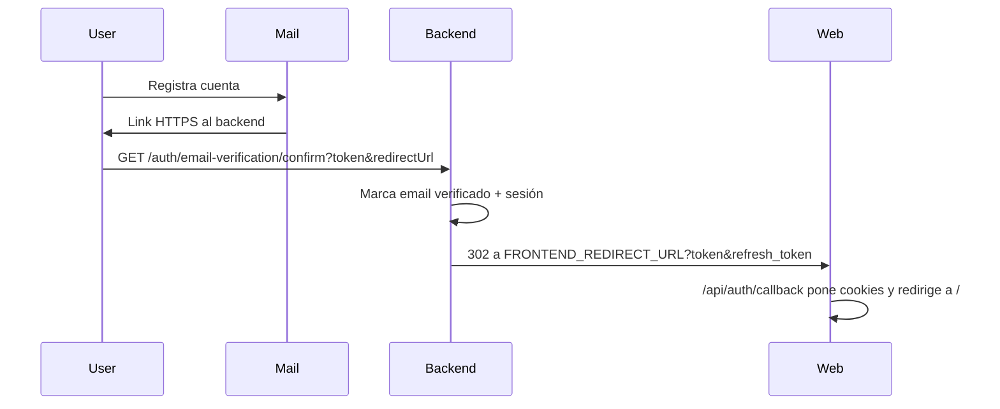
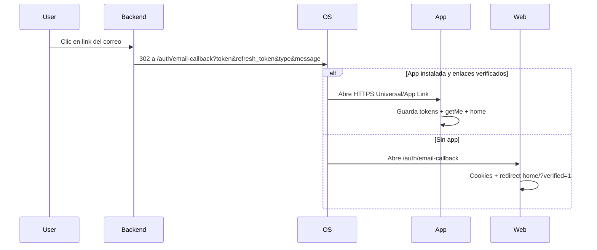

# Verificación de email: app o web según dispositivo

## Contexto actual

- El link se arma en [`email-verification.service.ts`](wiauto-backend/src/contexts/auth/services/email-verification.service.ts) con `FRONTEND_REDIRECT_URL` (callback web `/api/auth/callback`).
- Existe `FRONTEND_EMAIL_VERIFICATION_URL` en [`envs.ts`](wiauto-backend/src/common/envs.ts) y `resolveEmailVerificationRedirectUrl` en [`validate-redirect-url.ts`](wiauto-backend/src/contexts/auth/utils/validate-redirect-url.ts), pero **hoy no se usan**. Conviene cablearlos a `{FRONTEND_URL}/auth/email-callback` en lugar de inventar otra env.
- La app solo tiene scheme `wiauto://` ([`app.config.ts`](wiauto-mobile-app/app.config.ts)); `webOrigin` ya es `https://wiauto.es` en [`config.ts`](wiauto-mobile-app/src/constants/config.ts). **No** hay `associatedDomains` / `intentFilters` HTTPS ni pantalla que consuma tokens del deep link.
- Tras registro mobile, [`verify-otp.tsx`](wiauto-mobile-app/src/app/(auth)/verify-otp.tsx) es solo “revisa tu correo / reenviar”; no hay OTP ni `confirm` en el cliente.

Lo que describes son **Universal Links (iOS) + App Links (Android)**: mismo `https://…`, el SO abre la app si está instalada y verificada; si no, el navegador.

## Enfoque elegido

Mantener el confirm en el backend (ya crea sesión y emite tokens). Cambiar el `redirectUrl` del correo a una ruta HTTPS dedicada que:

1. En **web** haga lo mismo que hoy `/api/auth/callback` (cookies + redirect).
2. En **app** se capture por deep link y guarde tokens en `authStorage`.

Ruta nueva: `{FRONTEND_URL}/auth/email-callback` (ej. `https://wiauto.es/auth/email-callback`).

## Cambios por repo

### 1. Backend

- Cablear `FRONTEND_EMAIL_VERIFICATION_URL` (default `{FRONTEND_URL}/auth/email-callback`) en `buildVerificationLink` vía `resolveEmailVerificationRedirectUrl` si encaja; si no, construir esa URL y ampliar allowlist.
- Ampliar allowlist en [`email-verification.controller.ts`](wiauto-backend/src/contexts/auth/api/email-verification.controller.ts) para incluir esa URL exacta (hoy solo `FRONTEND_REDIRECT_URL` y `FRONTEND_URL`).
- Sin cambiar el contrato del GET confirm (sigue 302 con **tokens de sesión** en query: la app no necesita llamar a `confirm` otra vez).
- Redirect de error: hoy siempre va a `/iniciar-sesion` web; dejarlo así en v1 (fallback web).

### 2. Frontend (web)

- Nueva página/ruta [`app/auth/email-callback/`](wiauto-frontend/app/auth/email-callback/) (Server Component o route handler) que reutilice la lógica de [`app/api/auth/callback/route.ts`](wiauto-frontend/app/api/auth/callback/route.ts): set cookies access/refresh, manejar `2fa_challenge`, redirect a `/?verified=1` o login con error.
- Publicar archivos de asociación (necesario para que el SO confíe en el dominio):
  - `public/.well-known/apple-app-site-association` → paths `/auth/email-callback`
  - `public/.well-known/assetlinks.json` → package `com.faux.wiauto` + SHA-256 del keystore de release
- Asegurar `Content-Type: application/json` para AASA (Next a veces sirve bien desde `public/.well-known/`; si no, route handlers).

### 3. Mobile

- En [`app.config.ts`](wiauto-mobile-app/app.config.ts):
  - iOS: `associatedDomains: ['applinks:wiauto.es']` (host real de `FRONTEND_URL` / `EXPO_PUBLIC` web origin).
  - Android: `intentFilters` con `autoVerify: true`, scheme `https`, host del mismo dominio, `pathPrefix: '/auth/email-callback'`.
- Nueva pantalla Expo Router alineada al path, p. ej. [`src/app/auth/email-callback.tsx`](wiauto-mobile-app/src/app/auth/email-callback.tsx):
  - Leer `token`, `refresh_token`, `type`, `message` de la URL.
  - Si `type === '2fa_challenge'` → flujo 2FA existente.
  - Si no → `authStorage.setTokens` + `getMe` (mismo patrón que login en [`auth-provider.tsx`](wiauto-mobile-app/src/providers/auth-provider.tsx)) y `router.replace` al home.
- Ajustar copy de “verify-otp” post-registro para dejar claro que el enlace del correo puede abrir la app.

### 4. Ops / store (obligatorio para que funcione en dispositivos reales)

- Apple Developer: capability Associated Domains; rebuild nativo (EAS).
- Google Play: App Links verification con el SHA-256 correcto en `assetlinks.json`.
- Tras desplegar `.well-known`, validar con las herramientas de Apple/Google (no basta con Expo Go: hace falta build de desarrollo/producción).

## Fuera de alcance

- No migrar el correo a scheme `wiauto://` solo (rompe el fallback web).
- No tocar OAuth Google/Apple redirect salvo reutilizar helpers de cookies.
- No implementar OTP real; el enlace del mail sigue siendo la verificación.