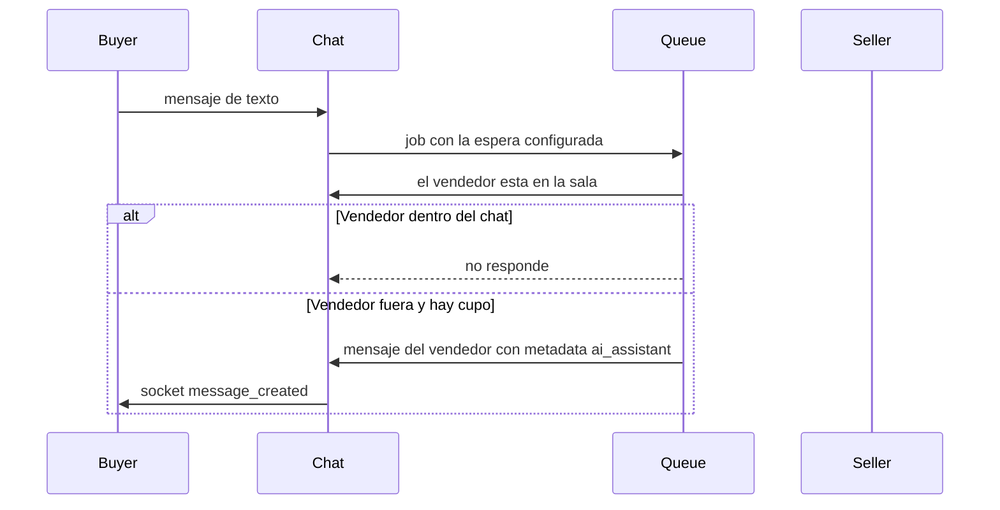

# Diagnóstico de anuncios y asistente de leads

## Entitlements

Catálogo en [entitlement-features.ts](wiauto-backend/src/contexts/billing/types/entitlement-features.ts), formulario de planes en [planEntitlementsFields.tsx](wiauto-dashboard/src/components/billing/forms/planEntitlementsFields.tsx), etiquetas en [entitlements.ts](wiauto-frontend/lib/billing/entitlements.ts) y el equivalente móvil.

Quitar del catálogo y de planes:

- `video_upload` (“Subida de vídeos”). Los vídeos quedan gobernados solo por `videos_per_vehicle`: `0` no permite subir; un número mayor sí. Ajustar [vehicleCreation.guard.ts](wiauto-backend/src/contexts/vehicles/guards/vehicleCreation.guard.ts), [vehicleUpdate.guard.ts](wiauto-backend/src/contexts/vehicles/guards/vehicleUpdate.guard.ts), el paso de media web y el paso 3 de la app.
- `advanced_listing_editor`. No hay endpoint propio: el formulario profesional reutiliza el mismo update. Borrar la ruta `app/usuario/editar-vehiculo-profesional` y `components/vehicles/professional-edit/`. [getVehicleEditUrl](wiauto-backend/src/common/frontend-routes.ts) apuntará siempre a `/editar-vehiculo/:id`.

Añadir, en el grupo “IA y analítica” del dashboard, debajo de las consultas de IA:

- `listing_insights` (boolean): diagnóstico de precio, salud y embudo.
- `ai_replies_per_conversation` (límite): mensajes que la IA puede enviar en un mismo chat. `0` = no incluido.
- `ai_lead_conversations` (límite medido por periodo, igual que `ai_requests`): conversaciones distintas en las que la IA puede intervenir este ciclo de facturación.

Migración nueva (no editar las ya aplicadas): borrar filas de `video_upload` y `advanced_listing_editor`; insertar los tres nuevos en `FREE_ENTITLEMENTS` y en versiones de plan publicadas con `false` / `0`, para que nadie los reciba hasta configurarlos en el dashboard.

## Diagnóstico solo con el entitlement

Hoy [GetVehicleInsightsController](wiauto-backend/src/contexts/vehicles/api/v1/get-vehicle-insights/get-vehicle-insights.controller.ts) solo exige ser dueño, y el listado de mis anuncios adjunta `health` siempre.

- Exigir `@RequireEntitlement("listing_insights")` en el GET de insights (los admins siguen pasando por el guard existente).
- No calcular `health` en el listado del dueño si no tiene el entitlement.
- En web y app, ocultar panel de éxito, badge, diagnóstico y ofertas de insights si `has("listing_insights")` es falso. La página de publicado sigue mostrando el éxito del anuncio.

## Asistente de leads

Nombre en el menú: **Asistente de leads**. Entra en los enlaces pro de [user.constants.ts](wiauto-frontend/app/usuario/constants/user.constants.ts), así que [professionalSidebar.tsx](wiauto-frontend/app/usuario/components/professionalSidebar.tsx) lo muestra con el resto de ítems de suscripción. Ruta `/usuario/asistente-leads`.

Ajustes del vendedor (una fila por perfil), no del plan:

- Activar o desactivar.
- Nota para el asistente, máximo 100 caracteres.
- Tono y estilo comercial, con las mismas opciones que la descripción generada ([description-generation-settings.mapper.ts](wiauto-backend/src/contexts/vehicles/services/description-generation-settings.mapper.ts)), mapeadas a un bloque de prompt propio.
- Espera antes de responder: al momento, 30 s, 1 min, 2 min o 5 min.
- Tres interruptores de avisos, cada uno independiente, con un texto corto y un tooltip:
  - Avisar cuando el asistente responda.
  - Avisar cuando no pueda responder porque se agotó el cupo.
  - Avisar cuando el lead parezca listo para cerrar. La explicación en pantalla dice que eso es cuando el comprador pide visita, reserva, financiación, prueba o da a entender que quiere quedarse el vehículo. No es una garantía de venta: es una señal para que el vendedor entre en el chat.

Cada campo lleva label claro y tooltip. Si el plan tiene ambos límites en 0, la página explica que hay que ampliar el plan y no deja guardar.

Comportamiento, en cola (no en el request del mensaje):

- Solo chats de vehículo, mensajes de texto del comprador. No soporte, no respuestas de la propia IA.
- “Está en el chat” = algún participante vendedor está en la sala `chat:<id>`. Eso ya lo resuelve `isUserInChatRoom` en [chat-message.gateway.ts](wiauto-backend/src/contexts/chat/gateways/chat-message.gateway.ts). Al ejecutarse el job se vuelve a comprobar la sala y si el vendedor escribió después.
- El mensaje sale con el `sender_id` del vendedor y `metadata.author = "ai_assistant"`, para que el comprador lo vea como respuesta del anuncio y no se dispare otro ciclo.
- Cupo por chat: contar esos mensajes. Cupo mensual: la primera respuesta de IA de ese chat en el periodo incrementa `ai_lead_conversations` con el uso medido ya existente.
- El prompt usa ficha del vehículo (precio, km, año, combustible, ubicación) más la nota del vendedor, y no inventa datos que no estén ahí.

La misma pantalla de ajustes va en la app. En el menú del panel ([user-panel-mock.ts](wiauto-mobile-app/src/components/user-panel/user-panel-mock.ts), sección pro que pinta [user-panel-screen.tsx](wiauto-mobile-app/src/components/user-panel/user-panel-screen.tsx)) entra el ítem **Asistente de leads** para quien tiene suscripción. Abre una ruta nueva, por ejemplo `lead-assistant`, con los mismos campos, tooltips y los tres interruptores de avisos. Si el plan no incluye los cupos, la pantalla explica que hay que ampliarlo y no deja guardar.

La respuesta automática sigue viviendo en el backend, así que da igual si el comprador escribe desde la web o desde la app. La app también actualiza el catálogo de entitlements, el límite de vídeos y oculta el diagnóstico sin `listing_insights`.

## Avisos al vendedor

El comprador sigue recibiendo el aviso normal de mensaje nuevo. Los avisos al vendedor salen solo si el interruptor de ese caso está activo.

- Cuando el asistente responde: una notificación con el nombre del comprador y un extracto, que abre ese chat.
- Cuando no responde porque se agotó el cupo del chat o el del mes: un aviso para que conteste en persona o amplíe el plan. Una vez por chat y periodo.
- Cuando el mismo paso de la IA marca el mensaje como lead caliente (visita, reserva, financiación, prueba o intención clara de compra): un aviso distinto para que el vendedor entre ya. Sale junto con la respuesta, no en lugar de ella. La clasificación va en la misma generación estructurada que el texto, sin una segunda llamada.

No avisar si no responde porque el vendedor ya está en el chat, el asistente está apagado o el vendedor escribió durante la espera.
